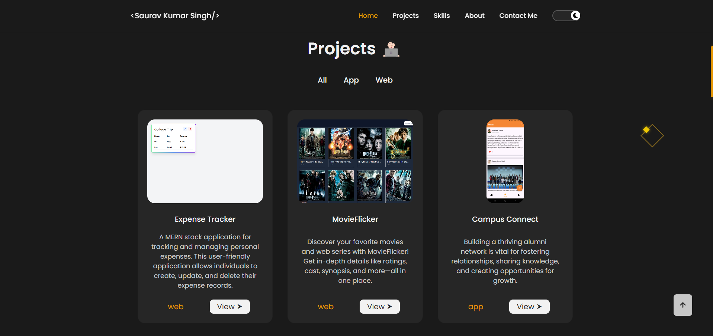

# 🌟 Saurav Kumar Singh  

### Full-Stack Developer | Mobile App Developer  

Passionate about developing modern web and mobile applications for various purposes. I specialize in building **scalable, user-centric, and high-performance** solutions using **React, Node.js, MongoDB, Firebase, and Flutter**.  

🔗 **[Visit My Portfolio](https://portfolio-sks-git-main-saurav-kumar-singhs-projects.vercel.app/)**  

## 📸 Screenshots  



---

## 🚀 Getting Started  

### 🔹 Clone the Repository  
```bash
git clone https://github.com/Saurav-KumarSingh/My-portfolio.git
cd My-portfolio

npm install  

npm run dev
